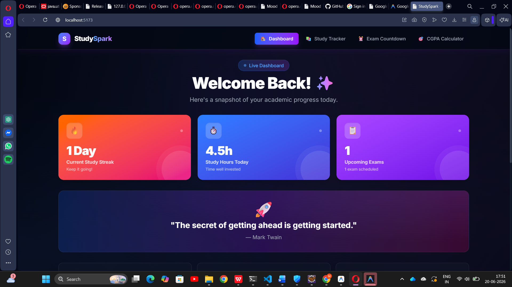
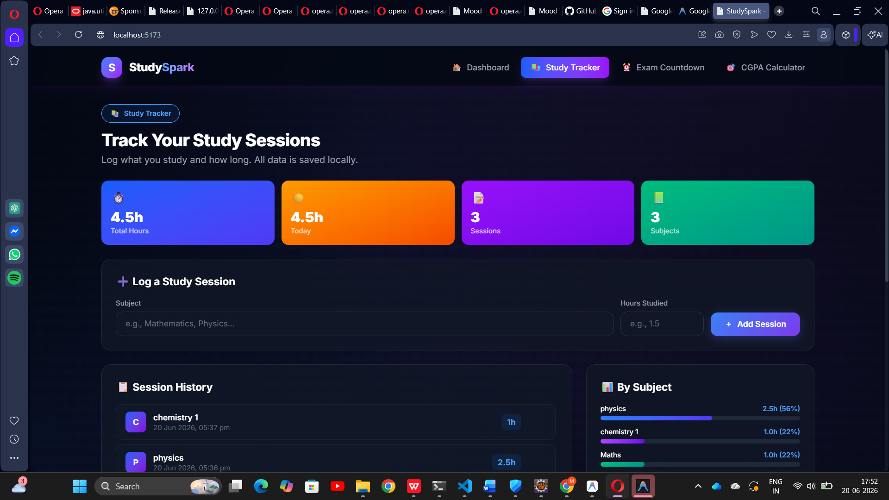
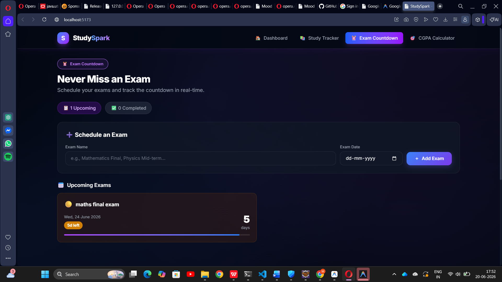
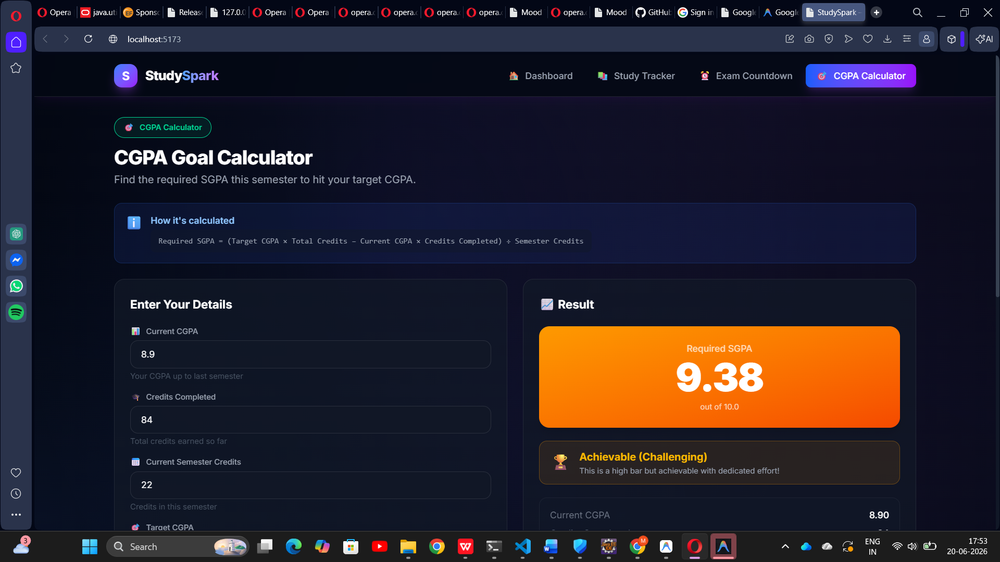
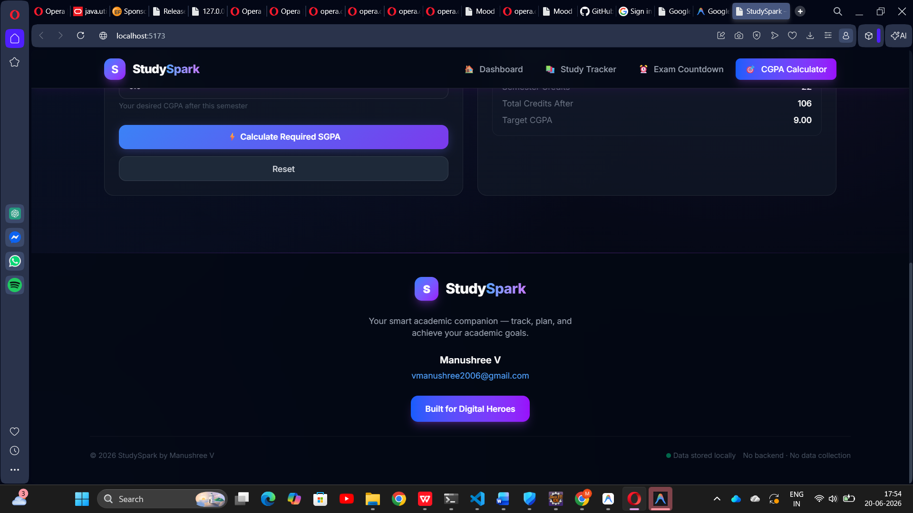

# ✨ StudySpark

> **Your smart academic companion** — track study sessions, countdown to exams, and calculate your CGPA goals, all in one sleek dashboard.


---

## 📖 Description

**StudySpark** is a modern, fully client-side academic productivity web app built with React + Vite and styled with Tailwind CSS. It helps students stay on top of their academic game by tracking study habits, monitoring exam deadlines, and planning CGPA goals — all without any backend or account required. All data is stored locally using `localStorage`.

---

## 🚀 Features

### 🏠 Dashboard
- **Study Streak** — Automatically calculates consecutive days studied
- **Study Hours Today** — Shows total hours logged for the current day
- **Upcoming Exams Count** — Live count of scheduled future exams
- Motivational quote banner and quick study tips

### 📚 Study Tracker
- Add subject name and hours studied per session
- View full session history with timestamps
- Delete individual sessions
- **Subject breakdown** with visual progress bars showing time distribution
- Summary stats: total hours, today's hours, session count, unique subjects

### ⏰ Exam Countdown
- Schedule exams with name and date
- Real-time countdown showing **days remaining**
- Color-coded urgency levels:
  - 🔴 **Red** — 3 days or fewer
  - 🟡 **Amber** — within a week
  - 🔵 **Blue** — within a month
  - 🟣 **Purple** — more than a month away
  - 🚨 **Today** — exam is today
- Completed exams section with history

### 🎯 CGPA Goal Calculator
- Input current CGPA, credits completed, semester credits, and target CGPA
- Calculates the **required SGPA** for the current semester using the formula:
  ```
  Required SGPA = (Target CGPA × Total Credits − Current CGPA × Credits Completed) ÷ Semester Credits
  ```
- Result display:
  - ✅ **Achievable** — if Required SGPA ≤ 10
  - ⚠️ **Difficult** — if Required SGPA > 10

### 🎨 Design
- Dark mode by default with blue and purple gradients
- Glassmorphism card design
- Smooth animations and hover effects
- Fully responsive — mobile, tablet, and desktop

---

## 🛠️ Technologies Used

| Technology | Purpose |
|------------|---------|
| [React 19](https://react.dev/) | UI framework |
| [Vite 8](https://vitejs.dev/) | Build tool & dev server |
| [Tailwind CSS 4](https://tailwindcss.com/) | Utility-first styling |
| [Inter (Google Fonts)](https://fonts.google.com/specimen/Inter) | Typography |
| `localStorage` | Client-side data persistence |

---

## 📦 Installation

### Prerequisites
- [Node.js](https://nodejs.org/) v18 or higher
- npm v9 or higher

### Steps

**1. Clone the repository**
```bash
git clone https://github.com/your-username/studyspark.git
cd studyspark
```

**2. Install dependencies**
```bash
npm install
```

**3. Start the development server**
```bash
npm run dev
```

**4. Open in your browser**
```
http://localhost:5173
```

### Build for Production
```bash
npm run build
```

### Preview Production Build
```bash
npm run preview
```

---

## 📁 Project Structure

```
StudySpark/
├── public/
├── src/
│   ├── components/
│   │   ├── Navbar.jsx          # Fixed top navigation with mobile menu
│   │   ├── Dashboard.jsx       # Stats overview with streak, hours, exams
│   │   ├── StudyTracker.jsx    # Add/view/delete study sessions
│   │   ├── ExamCountdown.jsx   # Schedule exams and view countdowns
│   │   ├── CGPACalculator.jsx  # Calculate required SGPA for target CGPA
│   │   └── Footer.jsx          # Footer with author info and links
│   ├── App.jsx                 # Root component with section routing
│   ├── main.jsx                # React entry point
│   └── index.css               # Global styles and Tailwind base
├── index.html
├── vite.config.js
├── tailwind.config.js
└── package.json
```

---

## 📸 Screenshots

### 🏠 Dashboard



---

### 📚 Study Tracker



---

### ⏰ Exam Countdown



---

### 🎯 CGPA Goal Calculator



---

### 👣 Footer



---

---

## 💾 Data Storage

StudySpark uses **`localStorage`** exclusively — no backend, no database, no account required.

| Key | Data Stored |
|-----|-------------|
| `studySessions` | Array of study session objects `{ id, subject, hours, date }` |
| `exams` | Array of exam objects `{ id, name, date }` |

> ⚠️ Clearing browser storage will erase all your data. Export or back up your data if needed.

---

## 🌐 Live Demo

Built and deployed for: [digitalheroesco.com](https://digitalheroesco.com)

---

## 👩‍💻 Author

**Manushree V**

📧 [vmanushree2006@gmail.com](mailto:vmanushree2006@gmail.com)

---

## 📄 License

This project is licensed under the **MIT License** — feel free to use, modify, and distribute.

---

<div align="center">
  Made with ❤️ by <strong>Manushree V</strong> &nbsp;|&nbsp; Built for <a href="https://digitalheroesco.com">Digital Heroes</a>
</div>
